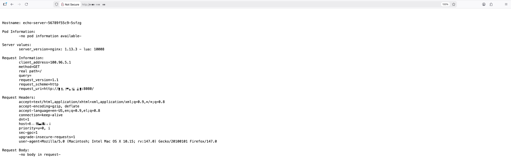
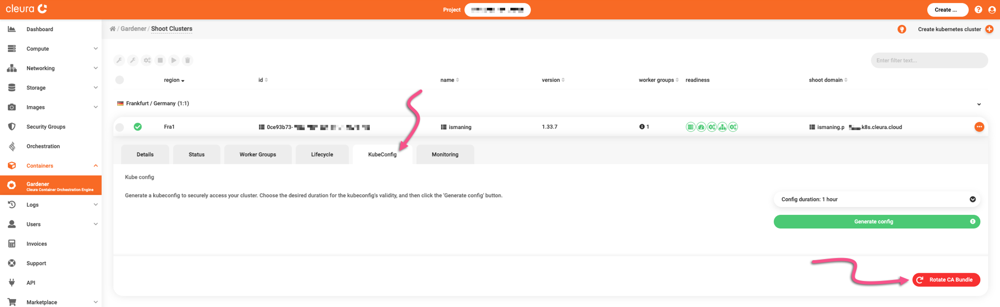
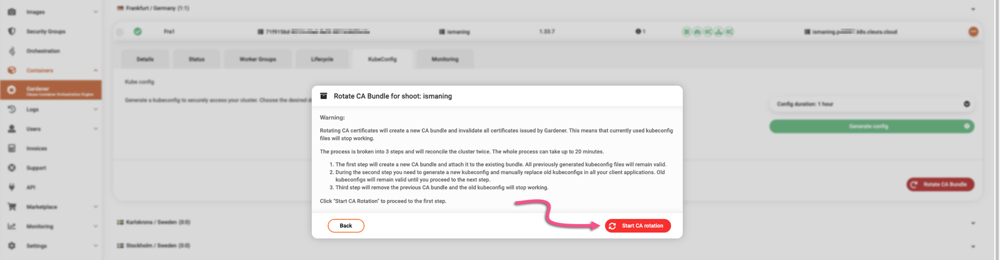
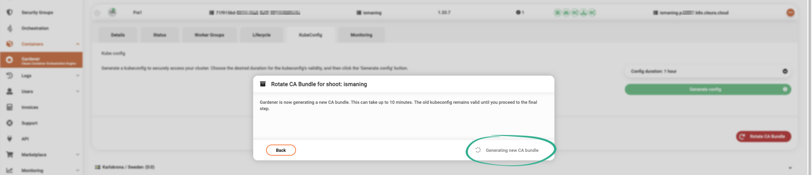
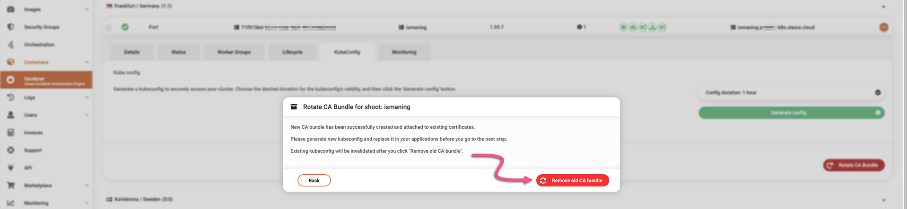
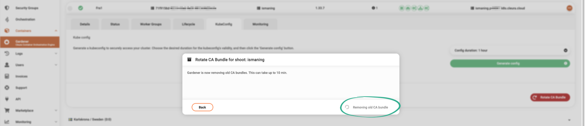
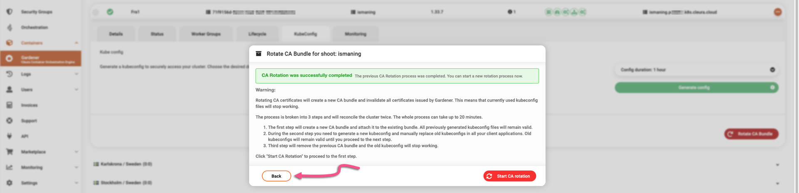
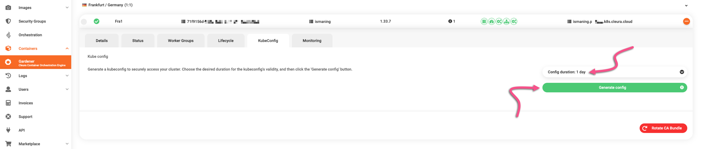
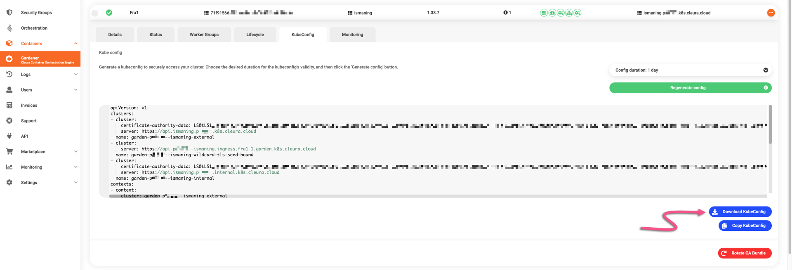

# Managing a Kubernetes cluster

Once you [have launched a new cluster](create-shoot-cluster.md), you can interact with it using `kubectl` with a [kubeconfig](https://kubernetes.io/docs/concepts/configuration/organize-cluster-access-kubeconfig/) file.

## Prerequisites

On your local computer, you should make sure you have `kubectl`, the Kubernetes command line tool.
As soon as you do, you may issue commands against your clusters.
To install `kubectl`, follow [the official documentation](https://kubernetes.io/docs/tasks/tools/#kubectl).

## Extracting the kubeconfig file

You can access your shoot cluster using a **certificate-based** kubeconfig file.
Such a kubeconfig is valid for a predefined amount of time, during which it can be used for accessing the corresponding shoot cluster with `cluster-admin` privileges.
The credentials associated with this type of kubeconfig are client certificates with time-limited validity.

To get a kubeconfig file for a shoot cluster, in the {{gui}} click on the cluster row to bring its properties into full view and go to the *KubeConfig* tab.

Notice that you may set the duration of the kubeconfig file validity.


The default validity period is one hour, but you may use the drop-down menu to select a different duration.


When satisfied with the duration, click the green button labeled *Generate config*.


Right below, you will see the contents of your dynamically generated kubeconfig.
To get the file, click the blue button labeled *Download KubeConfig*.


In the default download folder of your local user account, you will get a configuration file named like so:

```plain
kubeconfig--<cluster_name>--<region_name>--<project_id>.yaml
```

Create a directory named `.kube` in your local user's home, then move the YAML file you downloaded into it.
Rename the YAML to `config`, ending up with `~/.kube/config`.
By default, `kubectl` searches for its configuration in `~/.kube/config`.
If necessary, you can [modify this behavior](https://kubernetes.io/docs/concepts/configuration/organize-cluster-access-kubeconfig/) by setting the `KUBECONFIG` environment variable.
For example, if you want to retain the original filename exactly as downloaded, you might type something like the following:

```shell
export KUBECONFIG=~/.kube/kubeconfig--<cluster_name>--<region_name>--<project_id>.yaml
```

If you manage multiple Kubernetes clusters, you will probably prefer this approach.

## Verifying your kubeconfig

Check if your `kubectl` uses the proper configuration by running:

```shell
kubectl config view
```

You should see something like this:

```yaml
apiVersion: v1
clusters:
- cluster:
    certificate-authority-data: DATA+OMITTED
    server: https://api.ismaning.pqrxyz.k8s.cleura.cloud
  name: garden-pqrxyz--ismaning-external
- cluster:
    certificate-authority-data: DATA+OMITTED
    server: https://api.ismaning.pqrxyz.internal.k8s.cleura.cloud
  name: garden-pqrxyz--ismaning-internal
- cluster:
    server: https://api-pqrxyz--ismaning.ingress.fra1-1.garden.k8s.cleura.cloud
  name: garden-pqrxyz--ismaning-wildcard-tls-seed-bound
contexts:
- context:
    cluster: garden-pqrxyz--ismaning-external
    user: garden-pqrxyz--ismaning-external
  name: garden-pqrxyz--ismaning-external
- context:
    cluster: garden-pqrxyz--ismaning-internal
    user: garden-pqrxyz--ismaning-external
  name: garden-pqrxyz--ismaning-internal
- context:
    cluster: garden-pqrxyz--ismaning-wildcard-tls-seed-bound
    user: garden-pqrxyz--ismaning-external
  name: garden-pqrxyz--ismaning-wildcard-tls-seed-bound
current-context: garden-pqrxyz--ismaning-external
kind: Config
users:
- name: garden-pqrxyz--ismaning-external
  user:
    client-certificate-data: DATA+OMITTED
    client-key-data: DATA+OMITTED
```

Keep in mind that the cluster API endpoints (the `server` entries in your kubeconfig) are dynamically managed DNS addresses.
{{brand_container_orchestration}} automatically created the DNS records upon shoot cluster creation.

The DNS records will subsequently disappear when you delete the cluster.
They *also* disappear when you [hibernate the shoot cluster](hibernate-shoot-cluster.md), and reappear when you wake it from hibernation.

## Accessing your cluster with `kubectl`

Check your available nodes by running:

```shell
kubectl get nodes
```

Assuming you used the default options when creating the cluster, you should now see the three {{k8s_management_service}} worker nodes that are initially available:

```console
NAME                                            STATUS   ROLES    AGE   VERSION
shoot--pqrxyz--ismaning-1bc4ef-z1-798d7-2hndf   Ready    worker   11m   v1.33.7
shoot--pqrxyz--ismaning-1bc4ef-z1-798d7-5mj77   Ready    worker   11m   v1.33.7
shoot--pqrxyz--ismaning-1bc4ef-z1-798d7-kthv6   Ready    worker   11m   v1.33.7
```

> Please note that in contrast to other Kubernetes platforms, where the output of `kubectl get nodes` includes control plane *and* worker nodes, in a {{k8s_management_service}} cluster the same command *only* lists the worker nodes.

## Deploying an application

Create a sample deployment with an `echo-server` application:

```console
$ kubectl create deployment echo-server --image=k8s.gcr.io/echoserver:1.10
deployment.apps/echo-server created

$ kubectl expose deployment echo-server --type=LoadBalancer --port=80 --target-port=8080
service/echo-server exposed
```

To access the created app, list the available services:

```shell
kubectl get services
```

After a couple of minutes or so, you should get the load balancer service *with* its external IP and port number:

```console
$ kubectl get services
NAME          TYPE           CLUSTER-IP     EXTERNAL-IP   PORT(S)        AGE
echo-server   LoadBalancer   100.64.59.27   198.51.100.42 80:31511/TCP   26s
kubernetes    ClusterIP      100.64.0.1     <none>        443/TCP        49m
```

Open a browser and navigate to `http://198.51.100.42` (substituting the correct `EXTERNAL-IP` listed for your service).
You should see the page of the `echo-server` application.



## Rotating kubeconfig

You may rotate an existing kubeconfig for a fresh one.
Since certificate-based kubeconfig files have time-bound validity, issuing fresh kubeconfig files of this type is standard practice.

In addition to creating new certificate-based kubeconfig files, it is highly recommended to rotate the CA bundle used for creating them in the first place.
Here's how to go about it, using the {{gui}}.

Locate the shoot cluster you are interested in.
Click on its row to bring all relevant details into view, and go to the *KubeConfig* tab.
Click the red button labeled *Rotate CA Bundle*.



A new window pops up, informing you in detail about the 3-step process that is about to take place.
Please notice that it may take up to twenty minutes to complete.
When ready, click the red *Start CA rotation* button.



During the first step, a new CA bundle is generated.
This may take up to ten minutes to complete.
During that time, the existing kubeconfig file still works.



When the new CA bundle is ready, you remove the existing one by clicking the red *Remove old CA bundle* button.
As soon as you click it, the existing kubeconfig stops working.



The old CA bundle removal process may take up to ten minutes.
Notice the gray animated icon, indicating the process is ongoing.



It is now time to create a new certificate-based kubeconfig, which will be based on the new CA bundle.
This time, click the *Back* button, or the CA bundle creation process will start over.



Choose a duration for the new kubeconfig, then click the green *Generate config* button.



To get your new certificate-based kubeconfig file, click the blue *Download KubeConfig* button.


